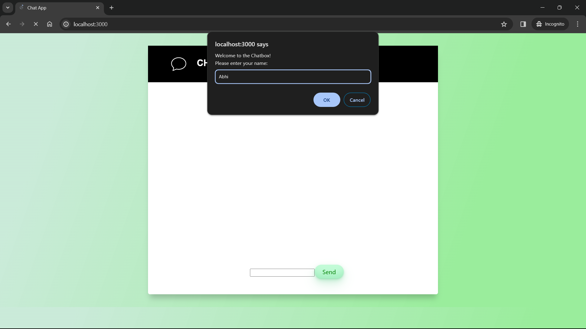
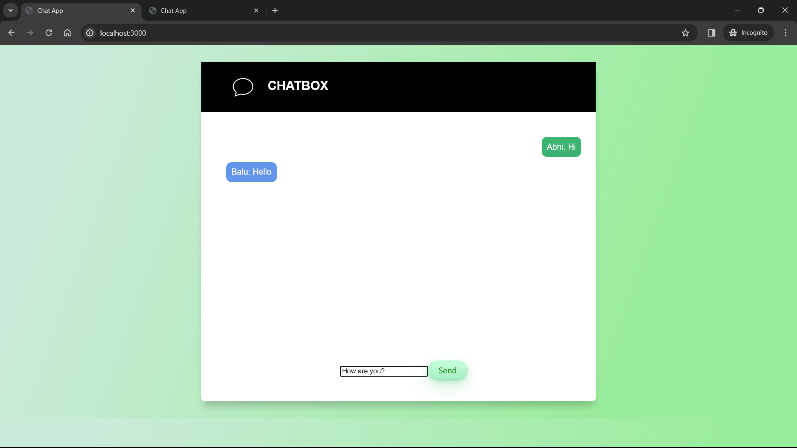
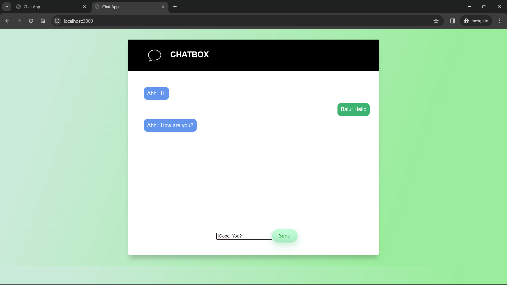

# Real-Time Chat Application

A simple real-time chat application using Socket.IO with Node.js.

## Table of Contents

- [Description](#description)
- [Features](#features)
- [Installation](#installation)
- [Usage](#usage)
- [Technologies](#technologies)
- [Contributing](#contributing)
- [License](#license)

## Description

This project is a real-time chat application built with Socket.IO and Node.js. It allows users to connect, chat in real-time, and share messages with other users.

## Features

- Real-time communication
- User-friendly interface
- Customizable styling
- Scalable and extensible

## Installation

1. Clone the repository:

   ```bash
   git clone https://github.com/Abhi-MS/ChatApp.git

2. Navigate to the project directory
3. Install dependencies

## Usage

1. Start the Node.js server
2. Open your web browser and go to http://localhost:3000.
3. Enter your name in the prompt and start chatting in real-time!
4. Test by using multiple browser tabs/windows

## Technologies

Node.js
Socket.IO
HTML
CSS
JavaScript

## Screenshots






